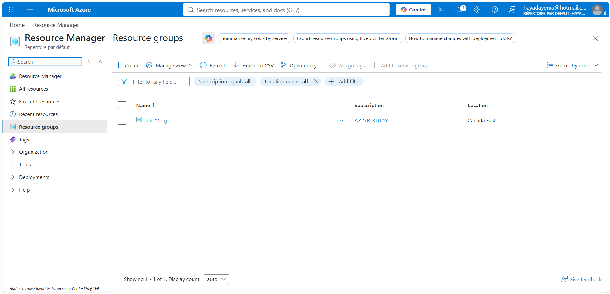
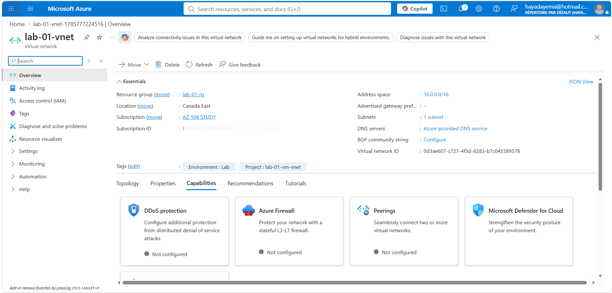
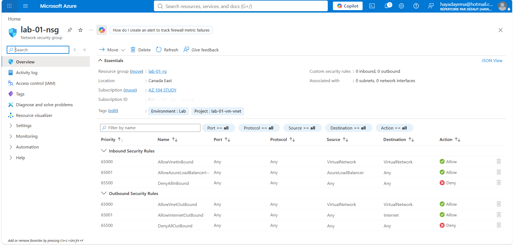
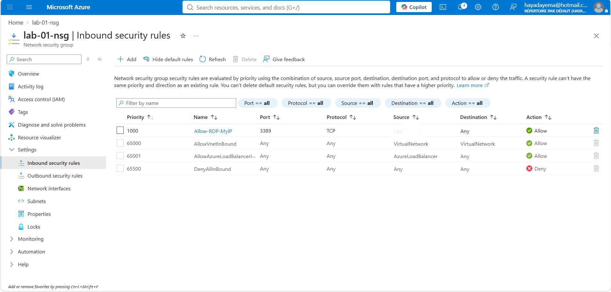
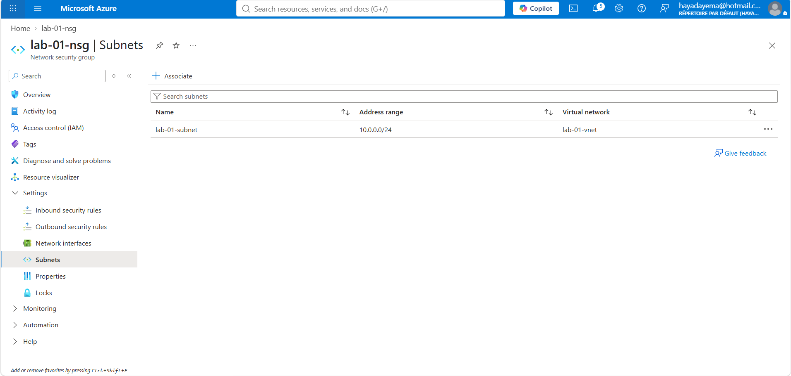
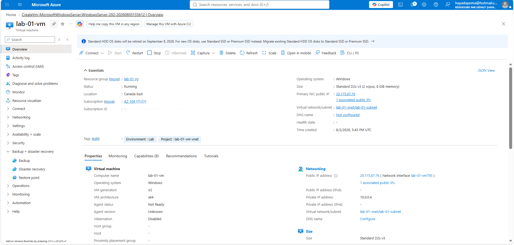
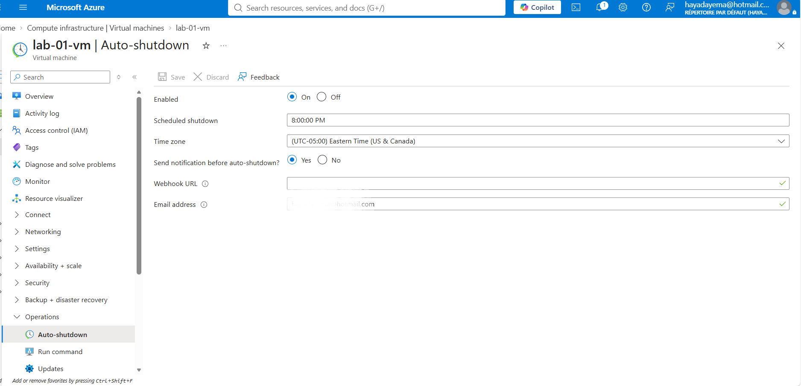
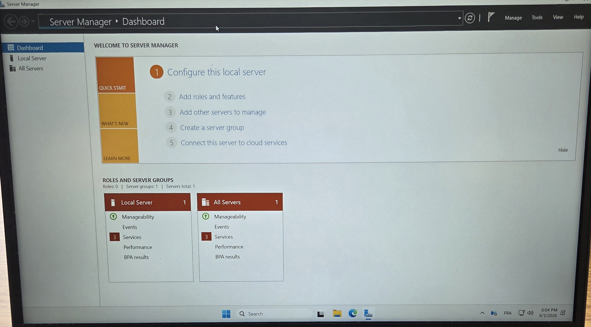

# Lab 01 — Windows VM with VNet, Subnet, and NSG

## Scenario

A company needs a Windows Server accessible only by their IT admin via RDP.
The server must be isolated in its own virtual network, protected by a network
security group that restricts access to a single authorized IP, with automatic
shutdown configured to control costs.

## Architecture

Resource Group: lab-01-rg (Canada East)
└── VNet: lab-01-vnet (10.0.0.0/16)
└── Subnet: lab-01-subnet (10.0.0.0/24)
└── NSG: lab-01-nsg
└── VM: lab-01-vm (Windows Server 2022, Standard D2s v3)

## Resources Created
| Resource |---------------------- Name | -------------------------------------Details |
| Resource Group |------------- lab-01-rg | -------------------------------Canada East |
| Virtual Network | lab-01-vnet | 10.0.0.0/16 |
| Subnet | lab-01-subnet | 10.0.0.0/24 |
| Network Security Group | lab-01-nsg | Attached to subnet |
| Virtual Machine | lab-01-vm | Windows Server 2022, Standard D2s v3 |

## Steps

**1. Created Resource Group** `lab-01-rg` in Canada East with Environment and Project tags.

**2. Created Virtual Network** `lab-01-vnet` (10.0.0.0/16) with subnet `lab-01-subnet` (10.0.0.0/24).

**3. Created NSG** `lab-01-nsg` — default rules deny all inbound traffic.

**4. Added inbound rule** to allow RDP (port 3389, TCP) from my IP only, priority 1000.

**5. Associated NSG** to `lab-01-subnet` — all resources in the subnet are now protected.

**6. Deployed VM** `lab-01-vm` — Windows Server 2022, Canada East, connected to `lab-01-vnet/lab-01-subnet`.

**7. Configured auto-shutdown** at 8:00 PM Eastern Time with email notification.

**8. Connected via RDP** — Windows Server Manager dashboard confirmed successful connection.

**9. Deleted** `lab-01-rg` at end of session — removes all resources at once.

## Problem I Hit
**Problem:** Downloaded RDP file was blocked by Windows Smart App Control and wouldn't open.  
**Fix:** Right-clicked the file → Properties → checked Unblock → Applied → file opened normally.

## Security Decisions
- NSG inbound rule restricts RDP (port 3389) to my specific public IP only — not open to 0.0.0.0/0
- NSG attached to the subnet, not the VM NIC — protects all resources in the subnet
- No public inbound ports selected during VM creation — NSG is the single control point

## Cost Decisions
- Standard HDD selected for OS disk — cheapest option, sufficient for a lab
- Auto-shutdown configured at 8:00 PM Eastern — prevents VM running overnight
- Entire Resource Group deleted at end of session — zero ongoing cost

## What I'd do in Production
- Use Azure Policy to inherit tags from the Resource Group automatically
- Restrict RDP further using Azure Bastion — no public IP needed on the VM
- Use Standard SSD or Premium SSD for production workloads
- Set up Azure Monitor alerts for VM health and availability

## AZ-104 Topics Covered
- Implement Virtual Networking (VNet, subnet, NSG)
- Manage Virtual Machines 
