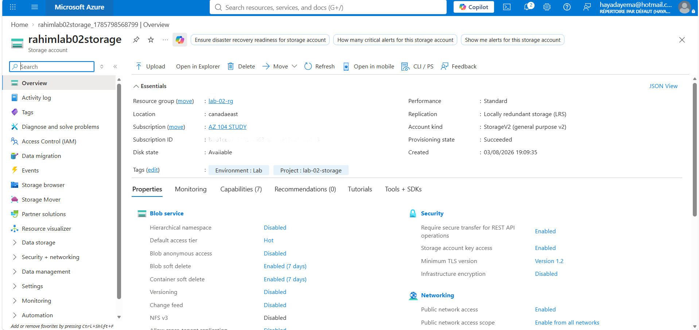
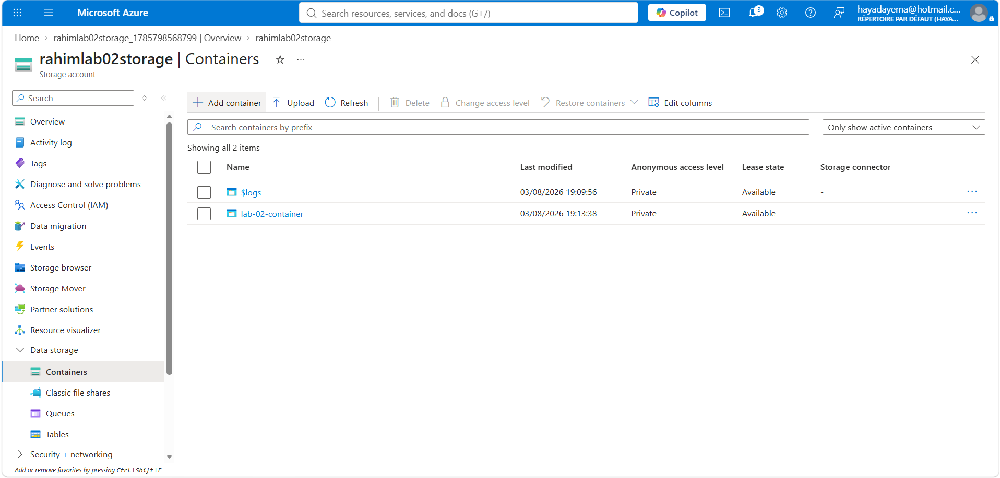
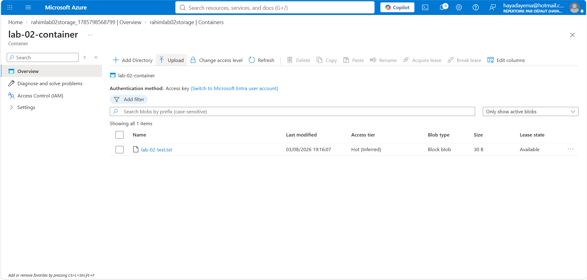
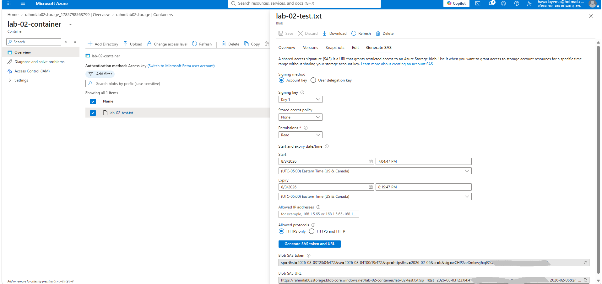
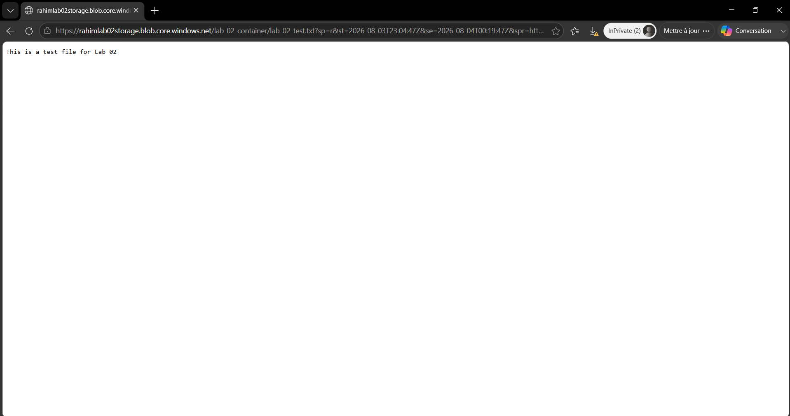

# Lab 02 — Blob Storage + SAS Token

## Scenario
A company needs to store files in the cloud and share specific files securely
with external partners — without giving them access to the storage account
or exposing any credentials.

## Architecture

Resource Group: lab-02-rg (Canada East)

└── Storage Account: rahimlab02storage (Standard LRS)

└── Container: lab-02-container (Private)

└── Blob: lab-02-test.txt

└── SAS Token: Read only, 1 hour expiry, HTTPS only

## Resources Created

| Resource | Name | Details |
|---|---|---|
| Resource Group | lab-02-rg | Canada East |
| Storage Account | rahimlab02storage | Standard, LRS, StorageV2 |
| Container | lab-02-container | Private access |
| Blob | lab-02-test.txt | Block blob, Hot tier |

## Steps

**1. Created Resource Group** `lab-02-rg` in Canada East with Environment and Project tags.

**2. Created Storage Account** `rahimlab02storage` — Standard performance, LRS replication, Blob anonymous access disabled.

**3. Created container** `lab-02-container` with Private access — no anonymous access to any blob.

**4. Uploaded** `lab-02-test.txt` to the container — Block blob, Hot access tier.

**5. Generated SAS token** for `lab-02-test.txt` — Read permission only, 1 hour expiry, HTTPS only, signed with account Key 1.

**6. Tested SAS URL** in browser — file content accessible without any login or credentials.

**7. Deleted** `lab-02-rg` at end of session.

## Security Decisions
- Container set to Private — no anonymous access, all requests must be authenticated
- SAS token scoped to Read only — partner cannot modify or delete the file
- SAS token expiry set to 1 hour — minimizes exposure window if URL is leaked
- HTTPS only — prevents token interception over unencrypted connections

## Cost Decisions
- LRS replication — cheapest option, sufficient for a lab (no geo-redundancy needed)
- Hot access tier — default for active files; Cool or Archive would be cheaper for rarely accessed data
- Resource Group deleted at end of session — zero ongoing cost

## What I'd Do in Production
- Use a Stored Access Policy instead of an ad-hoc SAS — allows revoking access centrally
  without waiting for expiry
- Use User Delegation SAS instead of Account Key SAS — backed by Entra ID,
  more secure than sharing account keys
- Enable blob versioning for critical files — allows recovery from accidental deletion or overwrite
- Set lifecycle management policies to move old files to Cool or Archive tier automatically

## AZ-104 Topics Covered
- Configure Azure Storage (storage accounts, containers, blob types)
- Generate and manage Shared Access Signatures
- Understand access tiers (Hot, Cool, Archive)
