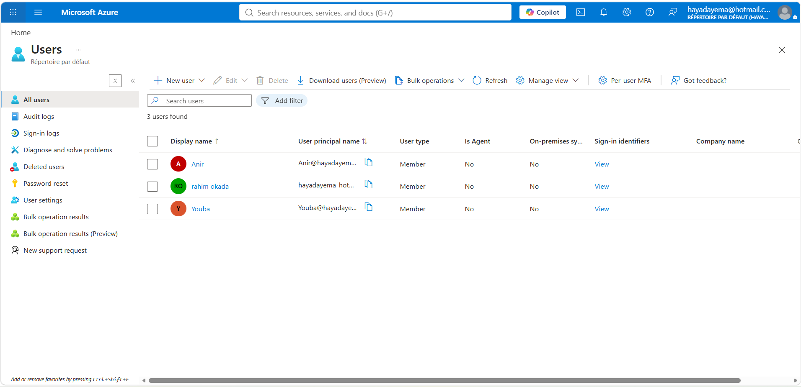
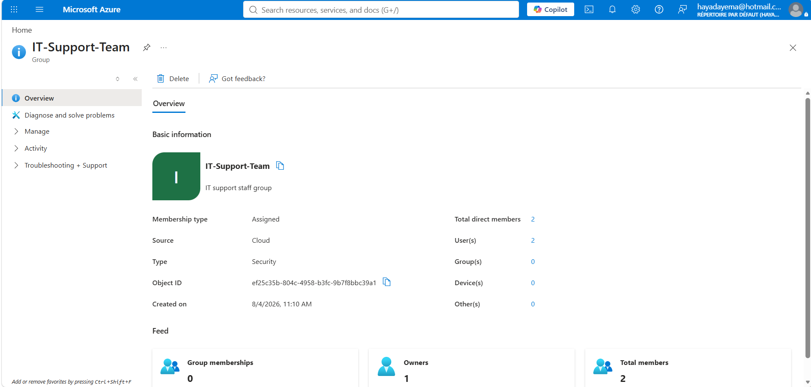
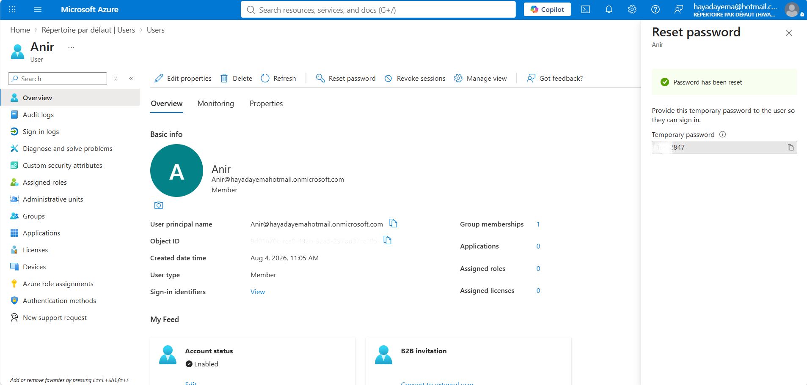
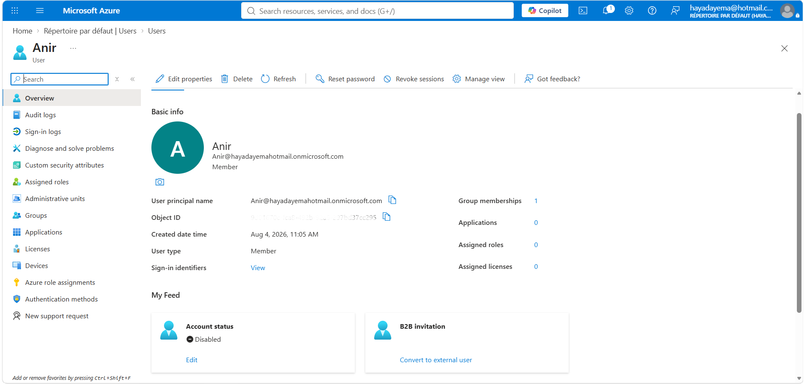

# Lab 03 — Entra ID: User and Group Management

## Scenario
A company is onboarding two new IT support employees. The administrator
needs to create their accounts, organize them into a security group,
reset a password, and disable an account when access is no longer needed.

## Architecture

Microsoft Entra ID (Tenant)

└── Users: Anir, Youba (IT Support Technicians)

└── Security Group: IT-Support-Team
## Resources Created

| Resource | Name | Details |
|---|---|---|
| User | Anir | Member, IT Support Technician |
| User | Youba | Member, IT Support Technician |
| Security Group | IT-Support-Team | Assigned membership, 2 members |

## Steps

**1. Created two users** — Anir and Youba — with job title and department assigned.

**2. Created security group** `IT-Support-Team` — Security type, Assigned membership,
both users added as members, IT admin set as owner.

**3. Reset password** for Anir — generated temporary password to hand off to the user.

**4. Disabled Anir's account** — simulating an employee offboarding scenario.

**5. Deleted both users permanently** from Entra ID at end of session.

## Security Decisions
- Security group used instead of assigning permissions to individual users —
  easier to manage.
- IT admin set as group owner — maintains clear accountability for access control
- Account disabled before deletion.

## Cost Decisions

- Users deleted at end of session — no ongoing identity costs

## What I'd Do in Production
- Assign the security group the Reader role on a Resource Group —
  all members get access automatically without individual role assignments
- Enable MFA for all users before first sign-in
- Configure Conditional Access policies to restrict sign-in by location or device

## AZ-104 Topics Covered
- Manage Azure Active Directory (Entra ID) users and groups
- Configure user accounts and group memberships
- Understand role-based access control (RBAC) concepts

└── Members: Anir, Youba

└── Owner: Rahim (IT Admin)

