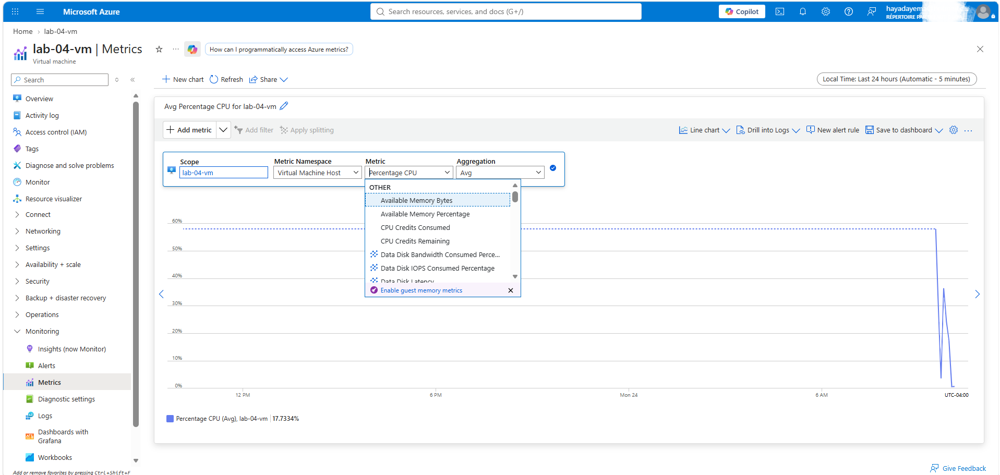

# Lab 04 — Azure Monitor + Alerts

## Scenario
A company needs to be automatically notified when their server CPU
exceeds safe levels, so the IT admin can respond before users are impacted.

## Architecture

Resource Group: lab-04-rg (Canada East)

└── Virtual Machine: lab-04-vm (Windows Server 2022)

└── Azure Monitor

└── Alert Rule: High-CPU-Alert

└── Condition: Percentage CPU > 80% (avg, 5 min)

└── Action Group: lab-04-action-group

└── Notification: Email alert

## Resources Created

| Resource | Name | Details |
|---|---|---|
| Resource Group | lab-04-rg | Canada East |
| Virtual Machine | lab-04-vm | Windows Server 2022, Standard D2s v3 |
| Alert Rule | High-CPU-Alert | Severity 2 - Warning |
| Action Group | lab-04-action-group | Email notification |

## Steps

**1. Deployed VM** `lab-04-vm` in Canada East — Windows Server 2022, tags applied.

**2. Configured alert condition** — Percentage CPU, static threshold, 
greater than 80%, average aggregation, checked every 1 minute over 5 minutes.

**3. Configured action group** — email notification triggered automatically
when alert fires.

**4. Set alert details** — name: High-CPU-Alert, severity: 2 Warning,
saved to lab-04-rg.

**5. Confirmed alert rule active** — Enabled, targeting lab-04-vm,
Percentage CPU > 80, signal type Metrics.

**6. Verified live CPU metrics** — chart shows average CPU at 17-25%
during VM startup spike.

**7. Deleted** `lab-04-rg` at end of session.

## Security Decisions
- Alert scoped to specific VM only — not subscription-wide
- Email notification sent to IT admin only — no public exposure

## Cost Decisions
- Azure Monitor basic metrics are free for VMs
- First 1000 alert rules per month are free
- Resource Group deleted at end of session — zero ongoing cost

## What I'd Do in Production
- Add additional alerts: available memory, disk space, failed login attempts
- Configure action groups to notify a team via Teams or PagerDuty
- Set up a Log Analytics workspace for deeper log-based alerting
- Use Azure Monitor Workbooks to build a visual dashboard for the team

## AZ-104 Topics Covered
- Monitor Azure resources using Azure Monitor
- Configure metric alerts and action groups
- Interpret VM performance metrics
