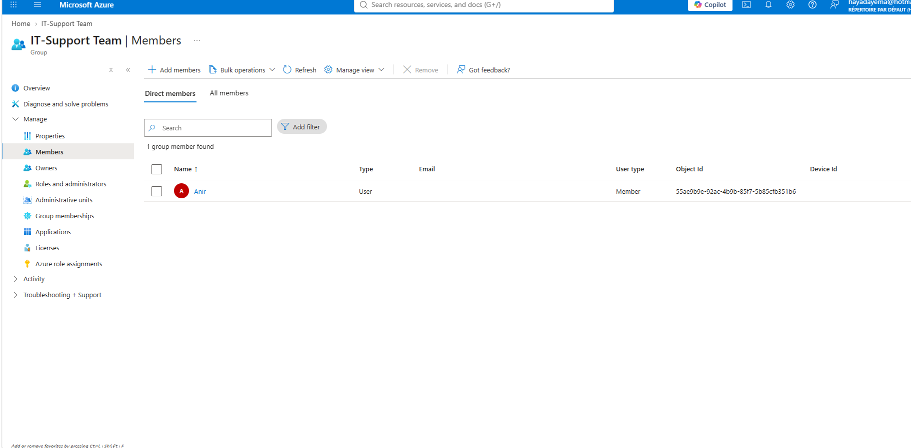
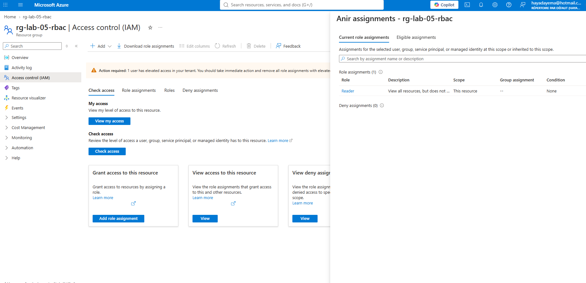
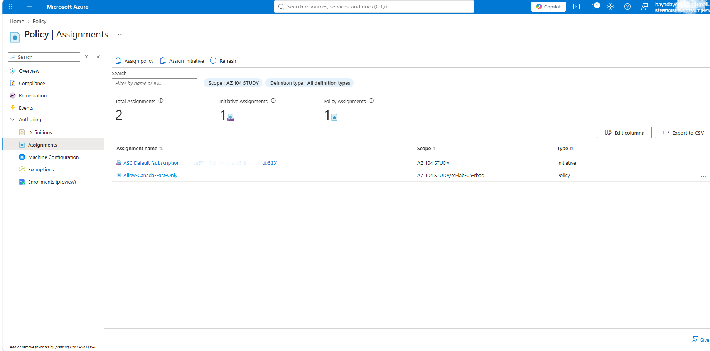
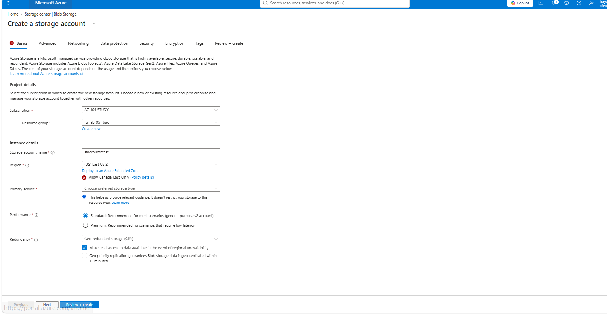

# Lab 05 — RBAC & Azure Policy

## Scenario
A company needs to control who can access cloud resources and enforce that no resources
are deployed outside approved regions, regardless of user permissions.

## Architecture

Resource Group: rg-lab-05-rbac (Canada East)
└── Entra ID

    └── User: Anir
    
    └── Security Group: IT-Support-Team
    
        └── Member: Anir
        
└── RBAC Assignment

    └── Role: Reader
    
    └── Principal: IT-Support-Team
    
    └── Scope: rg-lab-05-rbac
    
└── Azure Policy

    └── Assignment: Allow-Canada-East-Only
    
    └── Definition: Allowed locations
    
    └── Allowed region: Canada East

## Resources Created

| Resource | Name | Details |
|---|---|---|
| Resource Group | rg-lab-05-rbac | Canada East |
| Entra ID User | Anir | Test user, Member type |
| Security Group | IT-Support-Team | Security group, 1 member |
| RBAC Assignment | Reader | Scoped to rg-lab-05-rbac only |
| Policy Assignment | Allow-Canada-East-Only | Allowed locations — Canada East |

## Steps

**1. Created user Anir** in Microsoft Entra ID and added him to the **IT-Support-Team**
security group. Group-based assignment is best practice — access is managed at the group
level, not per individual user.

**2. Assigned Reader role** to IT-Support-Team, scoped to `rg-lab-05-rbac` only.
Anir can view all resources inside this RG but cannot create, modify, or delete anything.
Outside this RG, he has zero access.

**3. Created Azure Policy** — assigned the built-in *Allowed locations* policy to
`rg-lab-05-rbac`, permitting deployments to Canada East only. Named the assignment
`Allow-Canada-East-Only`.

**4. Tested policy enforcement** — attempted to create a Storage Account inside
`rg-lab-05-rbac` with region set to East US 2. Azure blocked the deployment in real time,
displaying the policy violation inline before submission. Policy enforces governance
regardless of the user's permission level — even an Owner cannot bypass a Deny policy.

**5. Deleted** `rg-lab-05-rbac`, user Anir, and group IT-Support-Team at end of session.

## Security Decisions
- Role assigned to a group, not an individual — scalable and auditable
- Reader role only
- RBAC scope limited to one resource group — no subscription-wide exposure
- Policy scoped to the lab RG only — rest of subscription unaffected

## Cost Decisions
- No billable resources were deployed inside the RG
- Azure Policy and RBAC assignments have no direct cost
- Resource Group deleted at end of session — zero ongoing cost

## What I'd Do in Production
- Use Entra ID dynamic groups to auto-assign access based on user attributes
- Layer multiple roles: Reader for most users, Contributor for senior admins only
- Create a custom role with only the specific permissions the team needs
- Apply Allowed locations policy at subscription level, not just one RG
- Use Azure Policy initiatives to bundle multiple governance rules into one assignment
- Enable Privileged Identity Management (PIM) for just-in-time access elevation

## AZ-104 Topics Covered
- Configure role-based access control (RBAC)
- Assign Azure roles at resource group scope
- Understand difference between RBAC and Azure Policy
- Create and assign Azure Policy definitions
- Apply principle of least privilege
- Enforce governance using built-in policy definitions
